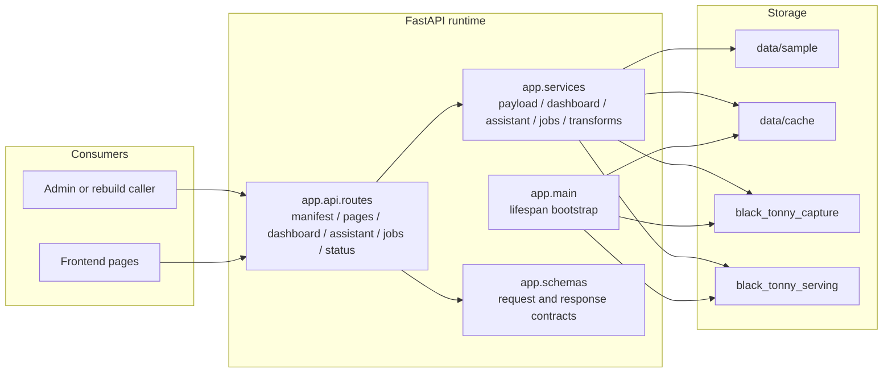

# Black Tonny Backend Architecture

This document is the primary architecture reference for `black-tonny-backend`.

It explains:

- what this repository owns
- how the runtime is structured
- how data moves from capture to serving
- which responsibilities belong to the backend in the split frontend/backend setup

For topic-level detail, use [docs/README.md](./docs/README.md).

For backend internal package layout and migration rules, also use [docs/backend-boilerplate-alignment.md](./docs/backend-boilerplate-alignment.md) and [docs/backend-boilerplate-migration-roadmap.md](./docs/backend-boilerplate-migration-roadmap.md). Those documents define how this repository must align to the local `FastAPI-boilerplate` baseline while preserving the current `capture` mainline and how the full migration should proceed.

## Repository Role

`black-tonny-backend` is the API, projection, and job-orchestration repository for Black Tonny.

Its current responsibilities are:

- expose FastAPI endpoints for page payloads, dashboard summary, jobs, and status
- expose formal backend business APIs for page payloads, dashboard summary, assistant chat, jobs, and status
- manage the `capture` and `serving` database split
- provide bootstrap-safe sample and cache fallbacks
- compute backend-owned summary metrics and date-range logic
- provide the formal service-side path for future page payload delivery

The backend is still in a staged transition:

- page payloads can still be served from sample and cache fallback sources
- frontend formal runtime pages already read backend APIs instead of local static samples
- `black_tonny_serving` is an evolving serving projection layer, not a finalized long-term canonical model

## Runtime Overview

## Layered Structure

### 1. Application bootstrap

The entrypoint is `app/main.py`.

Application startup is responsible for:

- configuring logging
- ensuring payload directories exist
- initializing database metadata

These concerns belong to the startup layer and should not be reimplemented inside route handlers.

### 2. API layer

Routes are composed in `app/api/__init__.py`, with internal route grouping under `app/api/v1/`.

Current public API surfaces include:

- `POST /api/auth/login`
- `POST /api/auth/logout`
- `GET /api/auth/codes`
- `GET /api/user/info`
- `GET /api/manifest`
- `GET /api/pages/{page_key}`
- `GET /api/dashboard/summary`
- `POST /api/assistant/chat`
- `GET /api/status`
- `POST /api/jobs/rebuild`
- `GET /api/jobs/{job_id}`

The route layer should stay thin:

- receive and validate inputs
- translate exceptions into HTTP responses
- call services
- return stable schema-driven outputs

For current formal business endpoints, successful `/api/*` responses should default to the standard envelope:

- `code`
- `data`
- `message`

The current lightweight exception is `GET /api/health`, which remains a probe-style endpoint rather than a frontend business data contract.

Current frontend business routes such as `manifest`, `pages`, `dashboard summary`, and `assistant chat` do not require a frontend bearer token in the current runtime phase.

### 3. Service layer

`app/services/` remains the operational center of the backend, but formal code should now land in the boilerplate-aligned subpackages:

- `app/services/runtime/`
- `app/services/capture/`
- `app/services/research/`
- `app/services/serving/`

Legacy flat `app/services/*.py` files are transitional compatibility shims unless a file is explicitly documented as a current formal entry.

Important service responsibilities include:

- frontend auth credential validation and token shaping for the formal `/api/auth/*` and `/api/user/info` contracts
- payload discovery, cache writes, and manifest generation
- dashboard summary calculation and fallback selection
- assistant chat contract handling and provider-side reply generation
- capture-batch and analysis-batch lifecycle management
- capture-to-serving normalization and projection writes
- rebuild job creation and status tracking

The service layer owns decisions such as:

- which source is authoritative for a given endpoint
- how metrics are calculated
- which tables are part of the current serving path

These decisions should not move into the frontend.

### 4. Schema layer

`app/schemas/` defines public API contracts.

Key contracts currently include:

- `FrontendLoginResponse`
- `FrontendUserInfoResponse`
- `ManifestResponse`
- `PagePayloadResponse`
- `DashboardSummaryResponse`
- `JobStatusResponse`

Schemas own response shape and validation constraints, but not business calculation logic.

### 5. Data layer

`app/db/` contains engine factories, metadata sets, and table definitions.

Key boundaries:

- `get_capture_engine()` is for capture and transformation work
- `get_serving_engine()` is for runtime tables and business-serving projections
- `capture_metadata` and `serving_metadata` must stay explicitly separated

The source of truth for database-layer boundaries is this file plus the database topic docs indexed in [docs/README.md](./docs/README.md).

## Boilerplate Alignment Baseline

This repository now treats the local `FastAPI-boilerplate` as the backend structural baseline.

That means:

- new formal runtime code should follow the boilerplate-style separation between `api`, `core`, `models`, `schemas`, `crud`, `middleware`, and orchestration
- `research`, Playwright probes, and evidence-chain helpers are still valid engineering tools, but they are not allowed to define the long-term runtime structure
- `capture` remains the highest-priority stable layer and must not be destabilized by research-driven growth

The detailed target layout lives in [docs/backend-boilerplate-alignment.md](./docs/backend-boilerplate-alignment.md). The phase-by-phase migration order lives in [docs/backend-boilerplate-migration-roadmap.md](./docs/backend-boilerplate-migration-roadmap.md).

## Transitional Internal Structure

The current repository still contains transition-era areas such as:

- `app/db/`
- `app/jobs/`
- a flat `app/services/`

At the same time, the first boilerplate-aligned target directories now exist:

- `app/models/`
- `app/crud/`
- `app/middleware/`
- `app/services/runtime/`
- `app/services/capture/`
- `app/services/research/`
- `app/services/serving/`

These are currently operational, but they should be treated as transitional where they diverge from the boilerplate baseline.

Until migration is complete, use the following rule:

- keep behavior stable
- keep `capture` stable
- move long-term structural ownership toward the boilerplate-aligned layout
- do not let generated ERP state panels or probe scripts become the architectural source of truth
- treat the new boilerplate-aligned directories as the default landing zone for new formal code

The current migration checkpoint is:

- Phase 0 complete: `capture` contracts are explicitly frozen
- Phase 1 complete: boilerplate-aligned directory scaffolding exists
- Phase 2 in progress: new formal code should prefer the new structure

## Data Flow

### Current page payload flow

The backend currently serves page payloads through a bootstrap-friendly fallback chain:

1. read `data/cache/` if cache content is available
2. fall back to `data/sample/` when cache content is missing

This behavior powers:

- `GET /api/manifest`
- `GET /api/pages/{page_key}`

The purpose is to keep the repository independently runnable while the fully serving-backed page delivery path is still maturing.

### Current dashboard summary flow

`GET /api/dashboard/summary` is already a backend-owned business endpoint.

Its service flow is:

1. build the current and compare date ranges from `preset`, `start_date`, and `end_date`
2. try the latest usable `analysis_batch` in `black_tonny_serving`
3. compute the summary from serving-side projection tables when possible
4. fall back to cache or sample summary templates when serving data is unavailable
5. return a stable API envelope whose `data` field contains the `dateRange + summary` contract

This means the backend owns:

- date-range construction
- compare-range construction
- metric calculation
- summary response shape

The frontend should display this contract, not recalculate it.

### Capture-to-serving flow

The long-term operational data path is:

1. upstream payloads are written to `black_tonny_capture`
2. payloads are normalized and validated by capture batch
3. serving-ready rows are written to `black_tonny_serving`
4. runtime APIs read from `serving`

## Database Boundary

### `black_tonny_capture`

Purpose: the more stable raw-data layer.

It should own:

- raw or near-raw endpoint payload storage
- replayable capture history
- capture auditability
- pre-transform batch tracking

Representative tables:

- `capture_batches`
- `capture_endpoint_payloads`

### `black_tonny_serving`

Purpose: the current service-facing projection layer.

It currently holds two kinds of data:

- application runtime tables
- business-serving projection tables

Representative tables:

- `job_runs`
- `job_steps`
- `cost_snapshots`
- `payload_cache_index`
- `analysis_batches`
- `sales_orders`
- `sales_order_items`
- `inventory_current`
- `inventory_daily_snapshot`

### Hard rules

These rules should hold unless explicitly reworked:

- business APIs do not read directly from `capture`
- capture and transform jobs may write to `capture` and then project into `serving`
- page APIs and dashboard APIs should prefer `serving`
- sample and cache are bootstrap and fallback aids, not long-term business truth sources

## Ownership Boundaries

The backend owns:

- API routes and schema definitions
- summary metric logic
- date-range and compare-range logic
- capture and serving data modeling
- rebuild, transform, and batch lifecycle logic
- formal service-side page payload sources

The backend does not own:

- page composition and layout sequencing
- page-level interaction choreography
- theme, visual styling, and component expression
- frontend-only presentation copy structure

If a change affects both metric semantics and page presentation, the backend contract should be updated first and the frontend rendering should follow it.

## Related Docs

- [docs/README.md](./docs/README.md)
- Optional sibling frontend architecture:
  - `../black-tonny-frontend/ARCHITECTURE.md`
