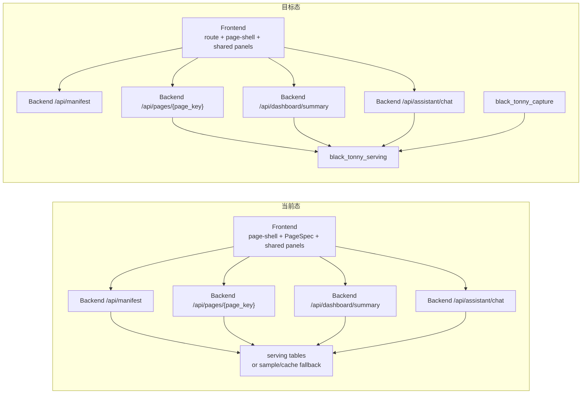

# Frontend / Backend Boundary

本文件定义 `black-tonny-frontend` 与 `black-tonny-backend` 的当前协作边界和后续迁移默认规则。

目标不是再造一套第三规范源，而是把跨仓库容易混淆的职责写清楚：

- 哪些属于前端拥有
- 哪些属于后端拥有
- 现在的过渡态是什么
- 后续往正式前后端协作迁移时，默认怎么推进

> 注：本文中的跨仓库相对链接按本地 `black-tonny-workspace` 目录结构编写，主要服务于当前 VS Code workspace 协作方式。

## Current And Target Topology

## Current State

当前仓库的真实接线已经进入“前端走正式 API、后端负责样本回退”的阶段。

### Frontend current source chain

前端业务页面当前主入口在 `apps/retail-admin/src/api/black-tonny.ts`：

- 登录页提交到 backend `POST /api/auth/login`
- guard bootstrap 继续请求 backend `GET /api/user/info` 与 `GET /api/auth/codes`
- `loadBlackTonnyManifest()` 请求 `/api/manifest`
- `loadBlackTonnyPayload(pageKey)` 按 manifest 中的 `available_pages` 请求 `/api/pages/{page_key}`
- `loadDashboardSummary()` 请求 `/api/dashboard/summary`
- 右侧 AI 助手聊天请求 `/api/assistant/chat`

也就是说：

- backend auth 已经是 frontend 正式运行主线
- 页面主 payload 已经来自后端 API
- Dashboard 顶部 8 卡已经来自后端 API
- 右侧 AI 助手聊天已经切到后端正式 API，frontend 仅保留联调兜底
- frontend repo 内的 `apps/backend-mock` 只保留同路径 dev/test fallback，不再是正式 auth source of truth

### Backend current source chain

后端当前暴露页面与运营相关能力：

- `POST /api/auth/login`
- `POST /api/auth/logout`
- `GET /api/auth/codes`
- `GET /api/user/info`
- `GET /api/manifest`
- `GET /api/pages/{page_key}`
- `GET /api/dashboard/summary`
- `POST /api/assistant/chat`

所以当前边界应理解为：

- 前端登录页 UI、guard、access bootstrap 编排仍在前端
- backend 已正式发放 frontend access token，并提供 `user/info` 与 access code 契约
- 当前 runtime 仍不要求 `manifest/pages/assistant` 依赖 frontend bearer token
- 前端页面壳、区块编排和展示仍在前端
- 页面数据和 summary 数据已经统一走后端正式 API
- 后端内部仍保留 sample/cache 作为 bootstrap 与缺数回退来源
- `dashboard summary` 是严格冻结边界，本轮不因 auth 主线而调整

## Ownership Matrix

| 领域 | 默认拥有方 | 说明 |
| --- | --- | --- |
| 页面路由、页面入口、页面级布局 | Frontend | 由 `apps/retail-admin` 路由和页面壳决定 |
| 登录页 UI、登录成功后的路由跳转 | Frontend | 由 `_core` 认证页面和 router guard 决定 |
| 登录页 UI、登录成功后的 guard 跳转编排 | Frontend | 由 `_core` 认证页面和 router guard 决定 |
| backend auth 契约、token 发放、`user/info`、access codes | Backend | 当前正式运行主线由 backend `/api/auth/*` 与 `/api/user/info` 拥有 |
| `apps/backend-mock` auth/user fallback | Frontend | 只作为单仓开发与 E2E fallback，不是正式 auth source of truth |
| `PageSpec`、区块编排、展开折叠规则 | Frontend | 属于页面表达层，不下沉到后端 |
| 共享面板组件与视觉层级 | Frontend | 例如 summary 卡片组、执行面板、经营分析面板 |
| 右侧 AI 助手 UI、上下文注入、线程展示 | Frontend | 布局级能力，当前统一挂在右侧 sidebar |
| 全局主题、配色、布局偏好 | Frontend | 统一以 `apps/retail-admin/src/preferences.ts` 为入口 |
| Dashboard 产品文案与交互规则 | Frontend | 以 frontend `docs/dashboard/*` 为主 |
| API 路由、请求参数、响应 schema | Backend | 由 FastAPI routes + schemas 拥有 |
| 日期区间、对比区间、summary 计算 | Backend | 不能由前端重算或复制一份逻辑 |
| AI 助手回复契约与 provider 接入 | Backend | frontend 不直连模型，统一走 backend `/api/assistant/chat` |
| 原始 payload 抓取与审计 | Backend | 落 `black_tonny_capture` |
| 业务投影表与 serving 查询逻辑 | Backend | 落 `black_tonny_serving` |
| rebuild / transform / batch 生命周期 | Backend | 属于任务与数据链路 |
| `tests/e2e/fixtures/*` / `docs/*` 样本 | Temporary bootstrap asset | 只应作为测试样本、文档样本或联调 fixture，不承担 runtime 真源 |

## Source Of Truth

跨仓库协作时，默认按下面几份文档判断规范源：

- 前端主架构规范源：
  - [../black-tonny-frontend/ARCHITECTURE.md（workspace 链接）](../../black-tonny-frontend/ARCHITECTURE.md)
- 后端主架构规范源：
  - [../black-tonny-backend/ARCHITECTURE.md](../ARCHITECTURE.md)
- 前端视觉与改动规范源：
  - [../black-tonny-frontend/docs/frontend-engineering-standard.md（workspace 链接）](../../black-tonny-frontend/docs/frontend-engineering-standard.md)
- 前端 `backend-mock` 规范源：
  - [../black-tonny-frontend/docs/backend-mock-standard.md（workspace 链接）](../../black-tonny-frontend/docs/backend-mock-standard.md)
- 前端登录与权限演进规范源：
  - [../black-tonny-frontend/docs/maintainers/login-evolution-handbook.md（workspace 链接）](../../black-tonny-frontend/docs/maintainers/login-evolution-handbook.md)
- 后端数据分层规范源：
  - [./two-database-architecture.md](./two-database-architecture.md)
- 后端内部结构脚手架规范源：
  - [./backend-boilerplate-alignment.md](./backend-boilerplate-alignment.md)
  - [./backend-boilerplate-migration-roadmap.md](./backend-boilerplate-migration-roadmap.md)
- 后端 frontend auth 契约规范源：
  - [./frontend-auth-api.md](./frontend-auth-api.md)
- Dashboard 页面产品与业务口径规范源：
  - [../black-tonny-frontend/docs/dashboard/overview.md（workspace 链接）](../../black-tonny-frontend/docs/dashboard/overview.md)
  - [../black-tonny-frontend/docs/dashboard/summary-metrics.md（workspace 链接）](../../black-tonny-frontend/docs/dashboard/summary-metrics.md)
  - [../black-tonny-frontend/docs/dashboard/interaction-rules.md（workspace 链接）](../../black-tonny-frontend/docs/dashboard/interaction-rules.md)
  - [../black-tonny-frontend/docs/dashboard/summary-analysis-logic.md（workspace 链接）](../../black-tonny-frontend/docs/dashboard/summary-analysis-logic.md)
- Dashboard API 与数据映射规范源：
  - [./dashboard/summary-api.md](./dashboard/summary-api.md)
  - [./dashboard/summary-capture-mapping.md](./dashboard/summary-capture-mapping.md)
- AI 助手聊天契约规范源：
  - [./assistant/chat-api.md](./assistant/chat-api.md)

## Development Defaults

### Frontend should own

- 页面结构、信息层级和交互节奏
- `PageSpec`、`page-shell`、shared component 的复用方式
- 主题、样式和布局密度
- 页面在空态、缺字段、局部无数据时的展示策略

### Backend should own

- 业务 API 契约
- 计算逻辑与指标语义
- 采集到投影的数据处理主链
- 批次状态、任务状态和数据可用性
- 页面 payload 的正式服务化承接
- backend 内部实现结构，并且该结构必须以 `FastAPI-boilerplate` 对齐文档为基线，而不是以临时 research 目录为基线

### Shared changes require both sides

以下类型的需求，默认视为前后端联动改动：

- 调整登录接口、token 规则或 `user/info` 字段
- 新增或修改 summary 指标
- 新增页面必须依赖的 payload 字段
- 调整 `manifest` / `pages` / `summary` 契约形状
- 调整 AI 助手 `context` / `recentMessages` / `reply` 契约形状
- 从静态样本或测试 fixture 向正式 API 切换数据来源

默认推进顺序：

1. 先确认产品和业务口径文档
2. 再确认后端 API / schema / 数据映射
3. 最后由前端落页面展示和交互

### Backend-mock default

当 backend 正式接口尚未落地，但 frontend 需要先推进页面时，默认按下面规则协作：

1. frontend 先在 `apps/backend-mock/api/*` 与 `apps/backend-mock/utils/*` 定义 mock route 与 helper
2. frontend mock 直接复用正式 `/api/*` 路径、method、query/body 字段名和 `{ code, data, message }`
3. frontend fixture 只允许留在 `apps/backend-mock/fixtures/*` 或 `docs/*`
4. backend 按同一路径、method、字段名和 envelope 实现正式接口
5. backend 契约文档一旦落地，就反过来成为长期规范源；frontend mock 必须继续对齐，不能再各写一套

这条规则的 frontend 侧详细标准，以 [../black-tonny-frontend/docs/backend-mock-standard.md（workspace 链接）](../../black-tonny-frontend/docs/backend-mock-standard.md) 为准。

## Migration Default

当前主迁移目标已经完成，后续默认目标是继续保持“前端只表达，后端负责正式数据入口”的边界。

推荐目标链路：

1. 前端继续保留 `PageSpec + page-shell + shared components`
2. 前端继续保留 `_core` auth 页面、guard 和 `frontend access mode`
3. 当前正式登录继续通过 backend `/api/auth/*` 与 `/api/user/info` 主线运行；`apps/backend-mock` 只保留同路径 dev/test fallback，不在页面、guard 或 frontend-local provider 内部散写
4. 后端继续稳定 `GET /api/manifest`、`GET /api/pages/{page_key}`、`GET /api/dashboard/summary` 契约
5. 后端继续稳定 `POST /api/assistant/chat` 契约
6. 样本和缓存回退逻辑继续留在 backend，不再反向散回前端页面
7. frontend 本地 AI 规则回复只保留为联调兜底，不升级成正式业务真源
8. repo-local 样本若继续保留，应集中在 `apps/backend-mock/fixtures/*` 或 `docs/*`，只视为测试、文档或联调样本
9. 业务接口鉴权范围继续保持最小；不顺手把 `manifest/pages/assistant` 扩成 frontend bearer 强依赖

迁移完成后，职责会更简单：

- 前端只关心页面表达
- 后端负责页面数据和指标数据
- 本地样本不再承担“业务真源”角色

补充一条内部实现规则：

- frontend 不应依赖 backend 内部 `research` / probe 代码的存在形式
- backend 必须把正式运行时结构收回到 boilerplate 风格的长期层次

## Related Docs

- [Backend Architecture](../ARCHITECTURE.md)
- [Frontend Architecture（workspace 链接）](../../black-tonny-frontend/ARCHITECTURE.md)
- [Frontend engineering standard（workspace 链接）](../../black-tonny-frontend/docs/frontend-engineering-standard.md)
- [Frontend backend-mock standard（workspace 链接）](../../black-tonny-frontend/docs/backend-mock-standard.md)
- [Frontend login evolution handbook（workspace 链接）](../../black-tonny-frontend/docs/maintainers/login-evolution-handbook.md)
- [Backend frontend auth contract](./frontend-auth-api.md)
